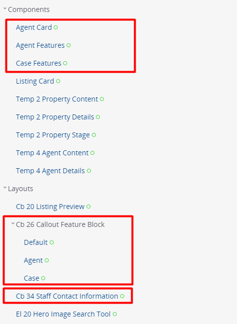

Project Set Up

1. Run `yarn install`
2. Run `yarn start` to start compiling sass, js, svgs and watch for changes  
 
### DEVTEST:

Additional components:
- 'Agent Card' for Staff Contact Information
- 'Agent Features' for Callout Feature Block (Agent Page)
- 'Case Features' for Callout Feature Block (Case Page)  

